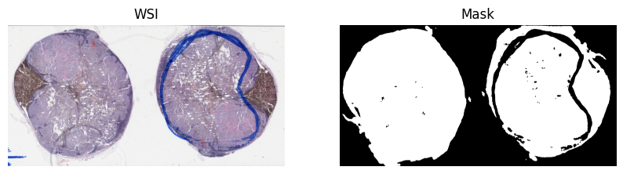

# tissue_masker_lite
This repository contains a deep learning based approach to creating tissue masks from whole-slide images.

## Highlights
* Light weight model, fast process speed
* Mask excludes slide artifacts including air bubbles and pen markings
* Support hardware acceleration on Apple Silicon Processors (by setting device='mps')

## Dependencies
* [TIAToolBox](https://github.com/TissueImageAnalytics/tiatoolbox)  
* [segmentation_models_pytorch](https://github.com/qubvel/segmentation_models.pytorch)

# How to use
## 1. Install it as a Python Package locally
Run `pip install .`  
## 2. Example usage:  
```
from tissue_masker_lite import get_mask
wsi_path = "path/to/wsi"
save_dir = "path/to/save_dir"
mask = get_mask(
    wsi_path=input_wsi,
    save_dir=save_dir,
    threshold=0.8,
    device="cuda",
    return_mask=True,
    save_mask=False,
)
```  

See `tiatoolbox_demo.ipynb` for demo.

# I/O details
Supported input file formats:  
Any Whole-Slide Image formats supported by [TIAToolBox](https://github.com/TissueImageAnalytics/tiatoolbox)  
Output binary mask format:  
`Numpy array of shape (H, W), dtype=numpy.uint8, magnification = 1.25`

# Examples



